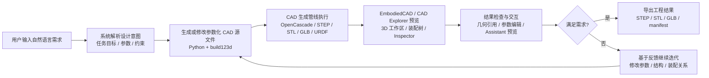
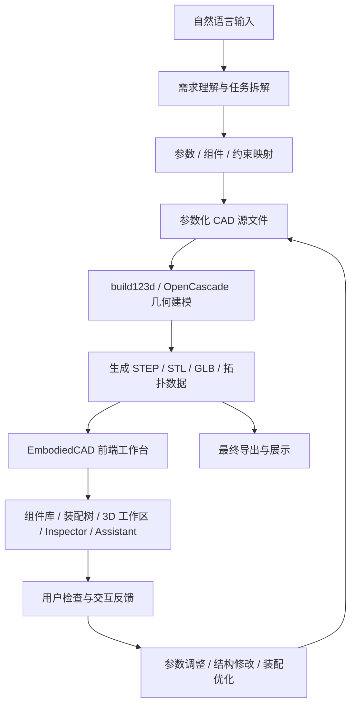

# EmbodiedCAD 项目流程图

## 简版流程图

## 申请材料可配说明

EmbodiedCAD 的核心流程是：将自然语言需求逐步转化为参数化建模结果，再通过工程工具链完成 CAD 生成、三维预览、结果检查和交互迭代。
它不是一次性“生成一个模型”，而是形成了“文本输入—模型生成—结果验证—继续修改”的闭环，更接近一个可持续交互和修正的智能体式工程设计系统。

## 若需要更技术化的版本

